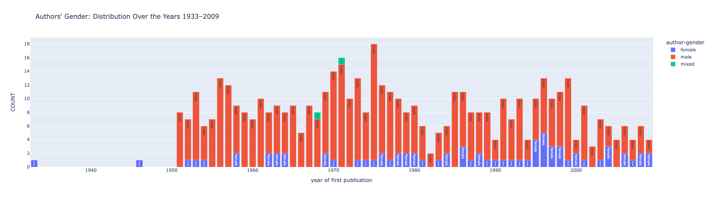
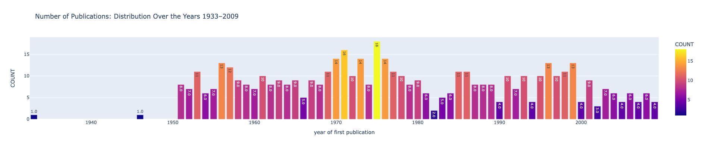

# This repository provides helpful code snippets in a Jupyter Notebook to visualise certain entries from the corpus metadata.

Including the amount of publications per year, gender distributions, etc.

**EXAMPLES**

